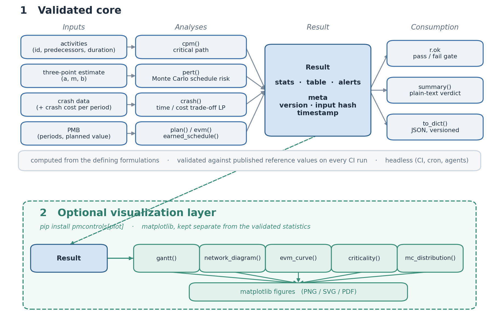
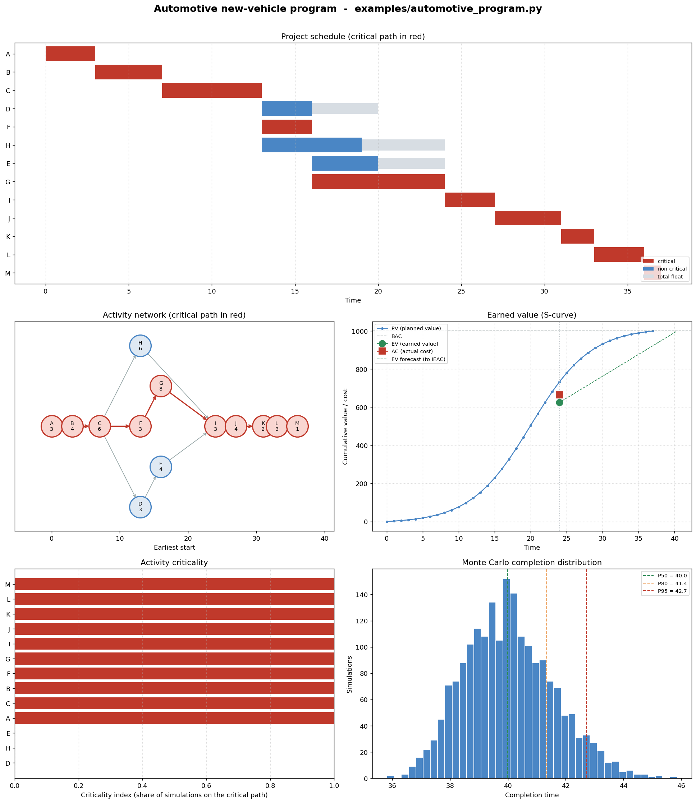

# pmcontrols

[](https://github.com/arikanatakan/pmcontrols/actions/workflows/ci.yml)
[](https://pypi.org/project/pmcontrols/)
[](LICENSE)

Project scheduling and earned value control for Python.

Critical path and PERT scheduling, minimum-cost schedule compression, and
earned value management with earned schedule. Results are computed from the
standard formulations and checked against reference values in the test suite.

An optional plotting layer turns any result into the standard project
visuals: a Gantt chart, an activity-network diagram, an earned-value
S-curve, a criticality bar chart, and a Monte Carlo completion histogram.



## Motivation

Every project office computes CPI and SPI, and almost all of it happens in
spreadsheets. R and commercial tools (Primavera, @RISK) cover schedule risk
and earned value. In Python the picture is uneven: the scheduling basics
exist, but the cost and forecasting side is thin, and nothing ties them
together under one validated interface.

| Method | State of the Python ecosystem |
| ------ | ----------------------------- |
| Critical path and PERT | available (pyCritical, networkx, assorted scripts) |
| Schedule crashing (time/cost LP) | no packaged library; built ad hoc on PuLP or SciPy |
| Earned value, full indicator set | only minimal or scattered implementations |
| Earned schedule (Lipke SPI(t)) | no maintained package |
| All of the above, validated, under one API | none |

pmcontrols is an attempt to fill that gap, with a few specific goals:

* compute every result from the defining formulation (the forward and
  backward pass, the linear program, Lipke's interpolation), not from
  spreadsheet shortcuts
* return one consistent `Result` with provenance, so a number can be
  recomputed and audited months later
* validate every released number against published reference values on each
  CI run
* work headless, so a weekly cost and schedule review can run as a cron job

```
pip install pmcontrols
```

Plotting is an optional layer: the validated core is built on the scientific
Python stack (numpy, scipy and pandas) and stays headless, so it runs in CI,
cron jobs and agents without a display. Add the `[plot]` extra (matplotlib)
only when you want the charts:

```
pip install "pmcontrols[plot]"
```

Documentation: https://arikanatakan.github.io/pmcontrols/

## Status

Version 0.2.1 is on PyPI. Implemented and tested:

* `cpm`: forward and backward pass returning ES, EF, LS, LF, total slack,
  and the zero-float critical path, with clear errors on cycles and unknown
  predecessors
* `pert`: three-point estimates (te = (a + 4m + b) / 6) along the critical
  path, plus a Monte Carlo simulation reporting the completion distribution
  (p50, p80, p95) and a per-activity criticality index
* `crash`: minimum-cost schedule compression to a target date, solved as the
  classical time/cost trade-off linear program (scipy, HiGHS)
* `evm`, `plan`, `earned_schedule`: cost and schedule variance, CPI and SPI,
  the estimate-at-completion family, TCPI and VAC, and Lipke's earned
  schedule (ES, SPI(t), IEAC(t)) evaluated against a frozen baseline
* visualization (optional, matplotlib via the `[plot]` extra), kept separate
  from the statistics: `gantt` (schedule), `network_diagram` (activity
  network with the critical path), `evm_curve` (earned value S-curve),
  `criticality` (Monte Carlo criticality bars), and `mc_distribution`
  (completion histogram)
* `Result`: every analysis returns named statistics, a tidy table,
  structured alerts, `r.ok`, `r.summary()`, and a JSON-safe `to_dict()` with
  provenance (version, input hash, timestamp)
* `PMB`: a Performance Measurement Baseline that validates a non-decreasing
  planned-value curve and round-trips through JSON
* a reference-case validation suite (tests/validation_cases.json), with the
  General Foundry network (full schedule, critical path, and optimal crash
  costs) and hand-derived EVM and earned-schedule cases reproduced in CI
  across Python 3.10 to 3.12

## Usage

Critical path, slack, and the full schedule:

```python
import pmcontrols as pm

activities = [
    {"id": "A", "predecessors": [],         "duration": 2},
    {"id": "B", "predecessors": [],         "duration": 3},
    {"id": "C", "predecessors": ["A"],      "duration": 2},
    {"id": "D", "predecessors": ["B"],      "duration": 4},
    {"id": "E", "predecessors": ["C"],      "duration": 4},
    {"id": "F", "predecessors": ["C"],      "duration": 3},
    {"id": "G", "predecessors": ["D", "E"], "duration": 5},
    {"id": "H", "predecessors": ["F", "G"], "duration": 2},
]

r = pm.cpm(activities)
r.stats["project_duration"]      # 15.0
r.meta["critical_activities"]    # ['A', 'C', 'E', 'G', 'H']
r.table                          # ES/EF/LS/LF/slack per activity
```

The numbers above are the standard General Foundry network from Render,
Stair & Hanna; the 15-period schedule and the A-C-E-G-H critical path are
computed by the forward and backward pass, and reproduced exactly as a
validation case.

Schedule risk from three-point estimates, with the Monte Carlo completion
distribution the analytic method cannot give:

```python
r = pm.pert([
    {"id": "X", "predecessors": [],    "a": 1, "m": 2, "b": 9},
    {"id": "Y", "predecessors": ["X"], "a": 2, "m": 3, "b": 10},
])
r.stats["mc_p80"]                # 80th-percentile completion time
r.table["criticality_index"]     # per activity, from the simulation
```

The cheapest way to hit a deadline, as a linear program rather than by hand:

```python
r = pm.crash(crash_activities, target=13)
r.stats["total_crash_cost"]      # globally optimal, not greedy
r.table["crash_amount"]          # how much to compress each activity
```

Freeze the planned value curve once, then control against it every period:

```python
import sys

pm.plan(periods, pv).save("pmb.json")   # commit this to version control

r = pm.evm("pmb.json", ev=30_000, ac=35_000, at=4)
r.ok                 # False if CPI or SPI(t) is below threshold
r.summary()          # plain text verdict
r.stats["ieac_t"]    # earned-schedule duration forecast
sys.exit(0 if r.ok else 1)
```

Any result can be turned into a chart (needs `pip install "pmcontrols[plot]"`):

```python
fig, ax = pm.gantt(pm.cpm(activities))   # critical path red, float light grey
fig.savefig("schedule.png")
```

The same extra gives `network_diagram` (the activity network), `evm_curve`
(the earned-value S-curve), and `criticality` / `mc_distribution` (Monte
Carlo schedule risk).

Every analysis returns the same `Result` object: named statistics, a tidy
table, a tuple of structured alerts, and provenance metadata (library
version, input hash, timestamp).

If you are wiring this into an AI agent, read
[Project control is not a language task](https://arikanatakan.github.io/pmcontrols/agents/)
first.

## Worked example

[`examples/automotive_program.py`](examples/automotive_program.py) runs the whole
toolkit on one program: a global automaker's concept-to-start-of-production
new-vehicle programme (work-breakdown following the automotive APQP phases;
durations and costs illustrative). It produces the critical path and schedule,
PERT schedule risk, a launch-window crash, and an earned-value status check.
Every chart it can draw, rendered by
[`docs/assets/example_automotive.py`](docs/assets/example_automotive.py), is
shown together below.



Read together, the panel tells one story. The **Gantt** (top) lays out the
37-month critical path (A-B-C-F-G-I-J-K-L-M) in red, with tooling (G, eight
months) as the long pole and total float in grey on the activities with slack;
the **activity network** (middle-left) shows why, the tooling branch dominating
the two shorter paths that feed the validation merge at I. The **earned-value
S-curve** (middle-right) places the program at month 24 below its planned-value
baseline (EV under PV, behind schedule) and over cost (AC above EV): CPI 0.94 and
SPI(t) 0.92 both breach the tighter 0.95 control limits, and the forecast lands
past the baseline. The **criticality bars** (bottom-left) make the risk stark,
ten activities on the critical path in 100% of the Monte Carlo runs and the three
alternative-branch activities (D, E, H) in none, so schedule risk sits entirely
on the spine, expedite tooling not the rest. The **completion histogram**
(bottom-right) shows the deterministic 37 months is optimistic: with the launch
downside the distribution is right-skewed to a p50 of 40.0, p80 of 41.4 and p95
of 42.7 months. The takeaway: at the checkpoint the program is both behind and
over budget, a realistic finish is three to six months past plan, and tooling is
the one lever worth paying to compress.

## Roadmap

| Version | Scope |
|---------|-------|
| 0.3     | published PMI/Lipke earned-schedule case-study validation; resource leveling and constrained scheduling; EVM from time-phased ledgers |
| 0.4     | critical chain buffers; probabilistic crashing; earned-schedule forecasting variants; JOSS paper |

pmcontrols plots Gantt charts and the other schedule visuals, but it is a
computation library, not a project-editing application. Out of scope:
interactive project editors and drag-and-drop schedulers (use dedicated PM
tools), and general linear programming (use scipy or pyomo directly).

## Related

[pmcontrols-mcp](https://github.com/arikanatakan/pmcontrols-mcp) exposes these
analyses and charts to AI agents over the Model Context Protocol.

## License

MIT. Written and maintained by [Atakan Arikan](https://github.com/arikanatakan),
MSc Student at Tsinghua University and Politecnico di Milano.
